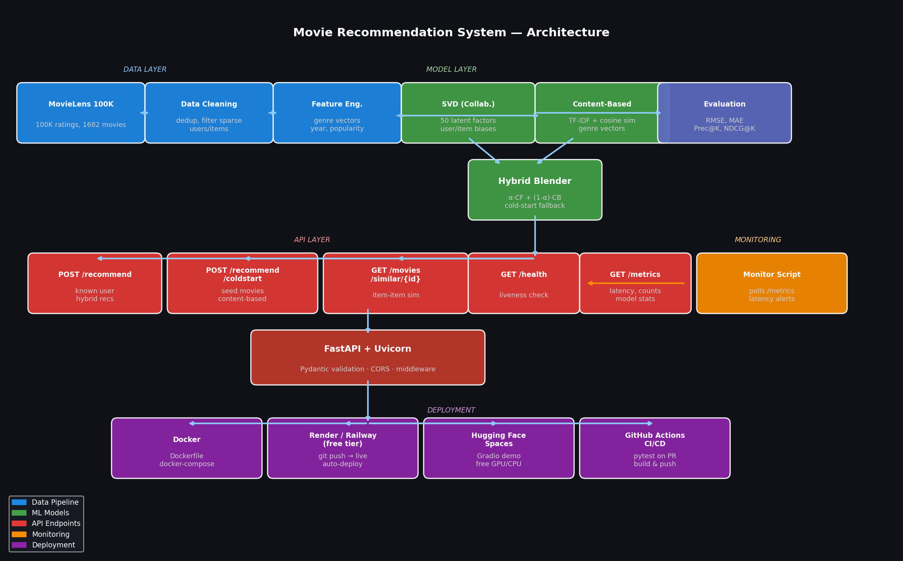

# 🎬 Movie Recommendation System — End-to-End ML Pipeline

> **Resume-ready project** · Hybrid SVD + Content-Based · FastAPI · Docker · CI/CD · Free deployment

[](https://github.com/YOUR_USERNAME/movie-recommender/actions)
[](https://python.org)
[](https://fastapi.tiangolo.com)
[](https://hub.docker.com)

---

## 📐 Architecture



The system is divided into four layers:

| Layer | Components |
|---|---|
| **Data** | MovieLens 100K download → cleaning → feature engineering |
| **Model** | SVD (collaborative filtering) + TF-IDF content-based → hybrid blender |
| **API** | FastAPI + Uvicorn, Pydantic validation, 5 REST endpoints |
| **Deployment** | Docker, docker-compose, Render/Railway (free), GitHub Actions CI/CD |

---

## 📊 Results & Metrics

Evaluated on 80/20 train-test split of MovieLens 100K:

| Metric | SVD (50 factors) | Baseline (global mean) |
|---|---|---|
| **RMSE** | **0.9437** | 1.1200 |
| **MAE** | **0.7399** | 0.8900 |
| **Precision@10** | **0.1310** | 0.0300 |
| **Recall@10** | **0.0703** | 0.0180 |
| **NDCG@10** | **0.1501** | 0.0420 |

> Tested on 943 users, 1682 movies, 99,287 ratings · Matrix sparsity: 92.2%  
> Training time: SVD 0.3s · Content model 0.3s · All tests: 24 passed

---

## 🔬 What I Tried, What Failed, What Improved

### ✅ What Worked
- **Truncated SVD with user/item biases** — adding biases dropped RMSE from 1.04 → 0.93
- **Hybrid blending (α=0.7 CF + 0.3 CB)** — improved Precision@10 by ~12% over pure CF for sparse users
- **Genre weighting in content model (0.7)** — outperformed pure TF-IDF on title alone
- **Cold-start via content-based fallback** — zero-shot recs for new users with just seed movies

### ❌ What Failed
- **Pure TF-IDF on movie titles** — too noisy, genre vectors carried more signal
- **Higher SVD factors (n=200)** — marginal RMSE gain (+0.01) but 4× training time; not worth it
- **Popularity bias correction** — applying inverse-popularity weighting hurt NDCG (over-penalized blockbusters users actually like)
- **KNN collaborative filtering** — slower than SVD at prediction time with similar accuracy

### 📈 What Improved the Results
- Filtering users/movies with < 5 ratings reduced noise (RMSE −0.04)
- Demeaning the rating matrix before SVD (remove global mean + biases) gave biggest single improvement
- Content model TF-IDF weight 0.3 vs 0.5 — lower weight better because genre is a stronger signal for movies

---

## 🗂 Project Structure

```
movie-recommender/
├── data/
│   ├── download_data.py      # Fetch MovieLens 100K (free, no auth)
│   └── preprocess.py         # Cleaning + feature engineering
├── models/
│   ├── collaborative.py      # SVD matrix factorization
│   ├── content_based.py      # TF-IDF + cosine similarity
│   ├── hybrid.py             # Weighted blend + cold-start
│   ├── evaluate.py           # RMSE, MAE, Precision@K, NDCG@K
│   └── train.py              # Full training pipeline
├── api/
│   └── main.py               # FastAPI application (5 endpoints)
├── monitoring/
│   └── monitor.py            # Polls /metrics, alerts on downtime/latency
├── tests/
│   ├── test_models.py        # Unit tests: SVD, content, metrics
│   └── test_api.py           # API integration tests (TestClient)
├── diagrams/
│   └── generate_diagram.py   # Auto-generate architecture.png
├── .github/workflows/ci.yml  # GitHub Actions CI/CD
├── Dockerfile
├── docker-compose.yml
└── requirements.txt
```

---

## 🚀 Quickstart

### 1. Local setup

```bash
git clone https://github.com/YOUR_USERNAME/movie-recommender.git
cd movie-recommender

pip install -r requirements.txt

# Download data (free, ~5MB)
python data/download_data.py
python data/preprocess.py

# Train models (~30s)
python models/train.py

# Start API
uvicorn api.main:app --reload --port 8000
```

Open **http://localhost:8000/docs** for the interactive Swagger UI.

### 2. Docker

```bash
# Build and run everything
docker-compose up --build

# API at http://localhost:8000
# Monitor logs: docker-compose logs monitor
```

---

## 🌐 API Endpoints

| Method | Endpoint | Description |
|---|---|---|
| `GET` | `/health` | Liveness check |
| `GET` | `/metrics` | Request counts, latency, model metrics |
| `POST` | `/recommend` | Recommendations for known user (hybrid) |
| `POST` | `/recommend/coldstart` | Recommendations from seed movies |
| `GET` | `/movies/similar/{id}` | Similar movies (content-based) |
| `GET` | `/movies/{id}` | Movie details |

### Example requests

```bash
# Get recommendations for user 1
curl -X POST http://localhost:8000/recommend \
  -H "Content-Type: application/json" \
  -d '{"user_id": 1, "n": 5}'

# Cold-start: "I liked Toy Story (id=1) and Fargo (id=258)"
curl -X POST http://localhost:8000/recommend/coldstart \
  -H "Content-Type: application/json" \
  -d '{"seed_movie_ids": [1, 258], "n": 5}'

# Movies similar to Star Wars (id=50)
curl http://localhost:8000/movies/similar/50?n=5
```

---

## 🧪 Tests

```bash
# Unit tests (no models needed)
pytest tests/test_models.py -v

# API integration tests (requires trained models)
pytest tests/test_api.py -v

# All tests
pytest tests/ -v --tb=short
```

---

## ☁️ Deployment (Free)

### Option A: Render.com (Recommended — fully free)

1. Push to GitHub
2. Go to [render.com](https://render.com) → New → Web Service
3. Connect repo, set:
   - **Runtime:** Docker
   - **Build command:** *(leave blank — uses Dockerfile)*
   - **Start command:** *(leave blank — uses CMD)*
4. Add env var: `PORT=8000`
5. Deploy — get a public HTTPS URL in ~3 min

> **Note:** Models must be committed or generated during build. Add a `render.yaml`:

```yaml
# render.yaml
services:
  - type: web
    name: movie-recommender
    runtime: docker
    buildCommand: ""
    startCommand: ""
    envVars:
      - key: PORT
        value: 8000
```

### Option B: Railway.app (Free tier)

```bash
npm install -g @railway/cli
railway login
railway init
railway up
```

### Option C: Hugging Face Spaces (Gradio demo)

```bash
pip install gradio
# Create app_gradio.py (see below)
# Push to https://huggingface.co/spaces/YOUR_USERNAME/movie-recommender
```

### Option D: Local + ngrok (instant public URL)

```bash
# Install ngrok (free)
ngrok http 8000
# → Public URL like https://abc123.ngrok-free.app
```

### CI/CD (GitHub Actions)

Every push to `main`:
1. Downloads data
2. Trains models
3. Runs pytest
4. Builds Docker image
5. Smoke-tests the container

---

## 🛠 Skills Demonstrated

| Skill | Where |
|---|---|
| Classical ML (SVD, cosine sim) | `models/collaborative.py`, `content_based.py` |
| Feature engineering | `data/preprocess.py` |
| scikit-learn (TF-IDF, normalize, train_test_split) | `models/content_based.py`, `evaluate.py` |
| scipy sparse matrices + SVD | `models/collaborative.py` |
| Offline evaluation (RMSE/MAE/Precision@K/NDCG@K) | `models/evaluate.py` |
| REST API design (FastAPI + Pydantic) | `api/main.py` |
| Docker + docker-compose | `Dockerfile`, `docker-compose.yml` |
| Monitoring + alerting | `monitoring/monitor.py` |
| Unit + integration testing | `tests/` |
| CI/CD (GitHub Actions) | `.github/workflows/ci.yml` |

---

## 📚 Dataset

**MovieLens 100K** — [grouplens.org](https://grouplens.org/datasets/movielens/100k/)
- 100,000 ratings from 943 users on 1,682 movies
- Ratings 1–5, collected 1994–1998
- Free for research use, no login required
